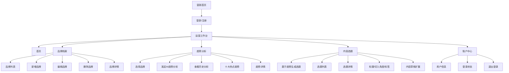
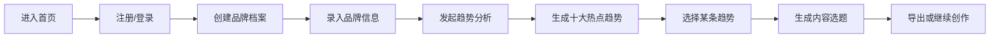
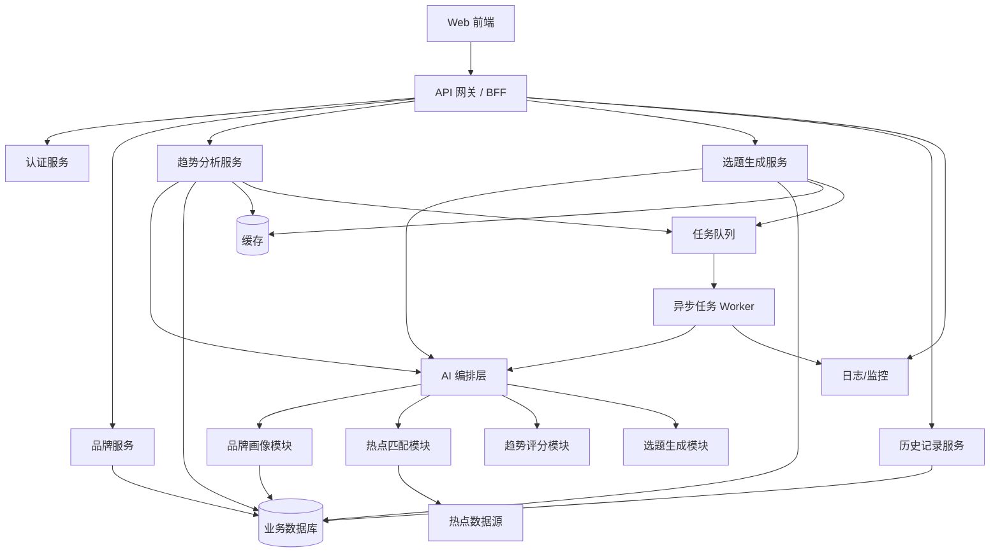
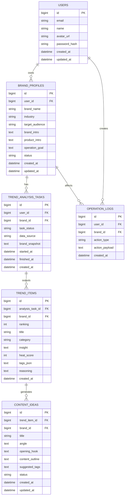
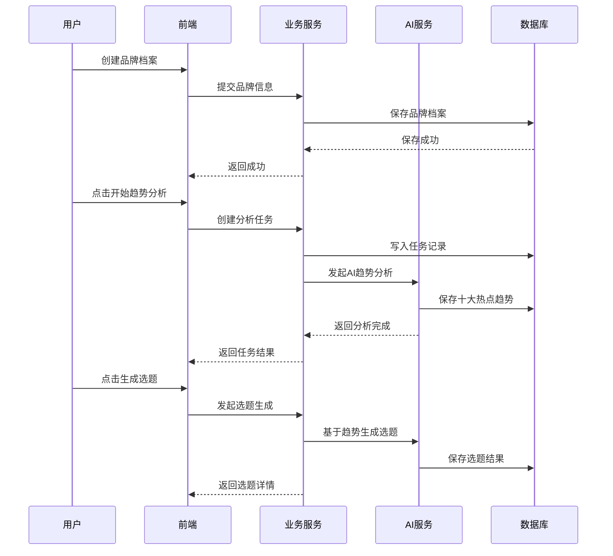

# RedBase 产品架构方案

## 1. 产品功能架构图

### 1.1 产品定位

`RedBase` 是一款面向品牌方与小红书运营团队的 AI 内容运营工具，核心目标是帮助用户从品牌信息出发，识别适配热点，并生成可执行的内容选题。

核心业务链路：

`品牌档案 -> 热点趋势分析 -> 内容选题生成 -> 运营执行`

### 1.2 功能架构图



### 1.3 功能分层说明

#### A. 获客层

- 营销首页
- 产品价值介绍
- 功能流程展示
- 免费试用入口
- 登录注册入口

#### B. 核心业务层

- 品牌档案管理
- 热点趋势分析
- 内容选题生成
- 分析历史与结果复用

#### C. 支撑层

- 用户登录与身份管理
- 结果存储与历史记录
- AI 服务编排
- 数据源管理

### 1.4 用户主流程



## 2. 技术架构图

### 2.1 总体技术架构



### 2.2 推荐技术分层

#### 前端层

- 官网落地页
- 登录后工作台
- 品牌管理界面
- 趋势分析结果页
- 内容选题结果页

可选技术：

- React / Next.js
- Tailwind CSS 或组件库
- Zustand / Redux 进行状态管理

#### 接入层

- API Gateway 或 BFF
- 统一鉴权
- 前后端协议聚合

职责：

- 聚合品牌、趋势、选题接口
- 屏蔽后端服务差异
- 统一返回前端可消费的数据结构

#### 应用服务层

- 用户服务
- 品牌服务
- 趋势分析服务
- 选题生成服务
- 历史记录服务

职责：

- 承接业务流程
- 校验参数
- 调度 AI 分析任务
- 读写数据库

#### AI 能力层

- 品牌理解
- 热点召回
- 热点匹配
- 趋势评分
- 选题生成

职责：

- 把品牌档案转换为品牌画像
- 根据热点数据筛选出最匹配趋势
- 输出结构化热点卡片和选题结果

#### 数据层

- MySQL / PostgreSQL：主业务数据
- Redis：缓存与会话
- 对象存储：截图、导出文件、附件
- 日志系统：审计与问题排查

#### 异步任务层

- 消息队列
- 后台 Worker

适用场景：

- 热点抓取
- AI 趋势分析
- 批量选题生成
- 历史结果重算

### 2.3 技术架构说明

系统更适合采用“同步查询 + 异步分析”的模式：

- 用户提交品牌信息是同步操作
- 用户点击“开始 AI 热点分析”后创建分析任务
- 后台异步调用数据源与大模型
- 分析完成后前端拉取或订阅结果

这样做的优势：

- 用户体验稳定
- 模型调用耗时可控
- 后续容易扩展到更复杂的分析任务

## 3. 数据库 / 实体关系图

### 3.1 核心实体

- 用户 `users`
- 品牌档案 `brand_profiles`
- 趋势分析任务 `trend_analysis_tasks`
- 趋势结果 `trend_items`
- 内容选题 `content_ideas`
- 操作历史 `operation_logs`

### 3.2 ER 图



### 3.3 核心表设计建议

#### `users`

用途：

- 存储平台用户基础信息

关键字段：

- `email`
- `name`
- `avatar_url`

#### `brand_profiles`

用途：

- 存储品牌档案，是后续 AI 分析的主要输入

关键字段：

- `brand_name`
- `industry`
- `target_audience`
- `brand_intro`
- `product_intro`
- `operation_goal`

#### `trend_analysis_tasks`

用途：

- 表示一次趋势分析行为

关键字段：

- `brand_id`
- `task_status`
- `brand_snapshot`
- `started_at`
- `finished_at`

说明：

- `brand_snapshot` 用来保存当次分析时的品牌快照，避免品牌信息修改后影响历史结果追溯

#### `trend_items`

用途：

- 保存单次分析产出的热点趋势

关键字段：

- `ranking`
- `title`
- `category`
- `insight`
- `heat_score`
- `tags_json`
- `reasoning`

#### `content_ideas`

用途：

- 保存从某条趋势派生出的内容选题

关键字段：

- `title`
- `angle`
- `opening_hook`
- `content_outline`
- `suggested_tags`

### 3.4 数据主链路

```text
users
  -> brand_profiles
    -> trend_analysis_tasks
      -> trend_items
        -> content_ideas
```

## 4. PRD 模块拆解

### 4.1 产品目标

帮助品牌和内容运营团队快速完成以下动作：

- 建立品牌画像
- 分析适配品牌的热点趋势
- 将热点转化为小红书内容选题
- 提升内容运营效率和热点命中率

### 4.2 目标用户

- 品牌市场团队
- 小红书运营人员
- 内容策划人员
- 中小商家主理人
- 代运营机构

### 4.3 模块拆解

#### 模块一：营销首页

目标：

- 清晰传达产品价值
- 促使用户注册和试用

主要功能：

- 品牌标语与价值表达
- 三步流程说明
- 功能介绍卡片
- 免费试用 CTA
- 登录入口

页面要点：

- 强调“热点洞察 + 选题生成”
- 说明适用场景是小红书运营

#### 模块二：登录注册

目标：

- 让用户进入工作台

主要功能：

- 邮箱登录
- 验证码登录或密码登录
- 会话维持
- 退出登录

#### 模块三：品牌档案管理

目标：

- 建立品牌输入上下文

主要功能：

- 查看品牌列表
- 新增品牌
- 编辑品牌
- 删除品牌
- 品牌详情展示

表单字段：

- 品牌名称
- 行业分类
- 目标受众
- 品牌介绍
- 产品介绍
- 运营目标

交互要求：

- 必填字段校验
- 表单保存提示
- 支持编辑已有品牌

业务价值：

- 解决 AI 对品牌缺乏理解的问题
- 为趋势分析和选题生成提供稳定输入

#### 模块四：趋势分析

目标：

- 生成与品牌匹配的热点趋势列表

主要功能：

- 选择品牌
- 发起 AI 趋势分析
- 查看历史分析记录
- 展示十大热点趋势
- 显示热点分数、标签、适配说明

趋势卡片建议字段：

- 趋势标题
- 趋势分类
- 品牌适配说明
- 热度分值
- 关键词标签
- 生成选题按钮

交互要求：

- 分析中状态展示
- 分析完成后结果刷新
- 支持查看历史记录

业务价值：

- 把泛热点转成品牌可用热点

#### 模块五：内容选题

目标：

- 将“品牌资产”与“热点趋势”结合，转化为实际可执行的内容方向

主要功能：

- 根据品牌资产和趋势联合生成选题
- 输出多个选题方案
- 查看选题详情
- 复制/导出选题
- 继续扩展成内容草稿

输入定义：

- 品牌档案
- 品牌资产标签
- 品牌核心卖点
- 目标受众
- 运营目标
- 单条热点趋势
- 热点标签与热度分
- 热点适配原因

选题结果建议字段：

- 选题标题
- 内容切入角度
- 品牌卖点结合方式
- 面向人群
- 内容摘要
- 开头钩子
- 推荐标签
- 内容结构提纲
- 适配该品牌的原因

业务价值：

- 缩短从热点判断到内容落地的路径
- 避免生成泛化内容，而是生成适合该品牌的小红书选题
- 让内容策划同时兼顾热点性与品牌一致性

生成逻辑：

```text
品牌资产 × 热点趋势 × 运营目标 = 品牌可用选题
```

生成原则：

- 热点必须和品牌人群或消费场景相关
- 选题必须体现品牌产品卖点或品牌价值
- 表达方式要符合小红书内容风格
- 输出应直接服务于涨粉、种草、转化或品牌认知目标

#### 模块六：历史记录

目标：

- 让分析结果可追溯、可复用

主要功能：

- 查看历史趋势分析
- 删除历史记录
- 按品牌查看历史分析
- 从历史结果继续生成选题

#### 模块七：账户中心

目标：

- 管理基础账号信息

主要功能：

- 查看用户资料
- 显示当前登录状态
- 退出登录

### 4.4 MVP 范围建议

第一期建议聚焦以下能力：

- 首页落地页
- 登录注册
- 品牌档案 CRUD
- 单品牌趋势分析
- 十大热点趋势展示
- 基于热点生成选题
- 历史分析记录

暂缓项：

- 多成员协作
- 评论区分析
- 内容日历
- 数据报表
- 多平台支持
- 自动发布

### 4.5 核心业务流程



### 4.6 关键指标建议

- 注册转化率
- 品牌档案创建率
- 趋势分析发起率
- 热点分析完成率
- 单次分析结果点击率
- 热点到选题转化率
- 用户复访率

## 5. 一句话总结

这套产品的完整架构可以总结为：

**一个围绕“品牌画像”展开的 AI 内容运营系统，通过品牌档案沉淀上下文，借助热点趋势分析筛选适合品牌的机会点，再将趋势自动转化为小红书内容选题，形成从洞察到运营落地的一站式闭环。**
